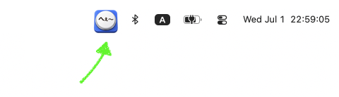

<p align="center">
  
</p>

# HeeButton

A tiny macOS menu bar app. Click the menu bar icon to play a sound (`he-.mp3`). That's it.

- **Left click** — play the sound (restarts from the top on each click)
- **Right click** — context menu:
  - **Icon** — pick the menu-bar icon (Button / Simple / Simple Blue)
  - **Volume** — set playback volume in 10 steps (10%–100%); selecting a level plays a preview
  - **Quit**
- Icon and volume choices persist across launches (`UserDefaults`)
- Lives only in the menu bar (no Dock icon)

## Icons

Pick one from the right-click **Icon** menu:

|  |  |  |
|:--:|:--:|:--:|
| Simple Blue (default) | Simple | Button (original) |

## Install

```sh
brew install kujiy/homebrew-tap/hee-button
```

Then launch it:

```sh
open -a HeeButton
```

The app is **not code-signed**. The Homebrew Cask removes the quarantine
attribute on install so it launches without a Gatekeeper prompt. If you download
the release zip manually instead of using Homebrew, macOS may warn on first
launch — right-click the app and choose *Open*, or run
`xattr -dr com.apple.quarantine /Applications/HeeButton.app`.

> Note: unsigned distribution relies on stripping the quarantine attribute.
> A future macOS release could tighten this policy, in which case the app would
> need proper signing/notarization.

## Build from source

Requires a recent Swift toolchain (built with Swift 6.3, targets macOS 15+).

```sh
bash Scripts/build-app.sh
open HeeButton.app
```

`Scripts/build-app.sh` runs `swift build -c release` and assembles
`HeeButton.app` (SwiftPM cannot embed an `Info.plist`, so the bundle layout is
built by the script). Pass a version string as the first argument to stamp it
into the bundle: `bash Scripts/build-app.sh 1.2.3`.

## Project layout

```text
Package.swift                  SwiftPM executable target + bundled resources
Sources/hee-button/
  main.swift                   NSApplication entry point (accessory / menu-bar only)
  AppDelegate.swift            NSStatusItem + click handling, icon/volume menu, prefs
  AudioPlayer.swift            AVAudioPlayer wrapper (restart-from-top, volume)
  IconChoice.swift             Selectable menu-bar icons
  Resources/                   icon PNGs (22px + @2x) for each choice, he-.mp3
Info.plist.template            LSUIElement + CFBundle keys (__VERSION__ placeholder)
Scripts/build-app.sh           Assemble HeeButton.app
Scripts/update-homebrew-cask.sh  CI: bump version/sha256 in kujiy/homebrew-tap
.github/workflows/             ci.yml (build on PR) / release.yml (tag -> release)
```

## Release

Push a tag to build, publish a GitHub Release with the zipped app, and update
the Homebrew Cask automatically:

```sh
git tag v1.0.0
git push origin v1.0.0
```

The release workflow requires a repository secret `HOMEBREW_TAP_TOKEN`
(a PAT with `repo` scope) so CI can push the updated Cask to
[kujiy/homebrew-tap](https://github.com/kujiy/homebrew-tap).
